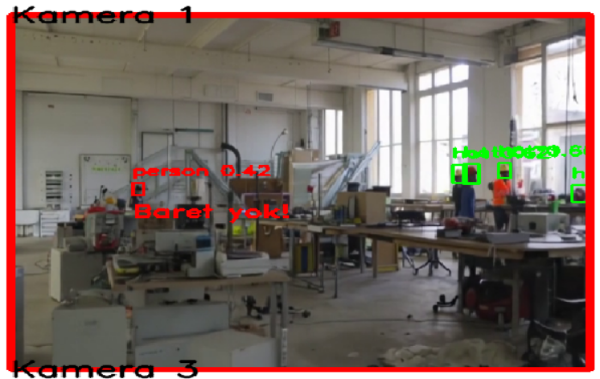
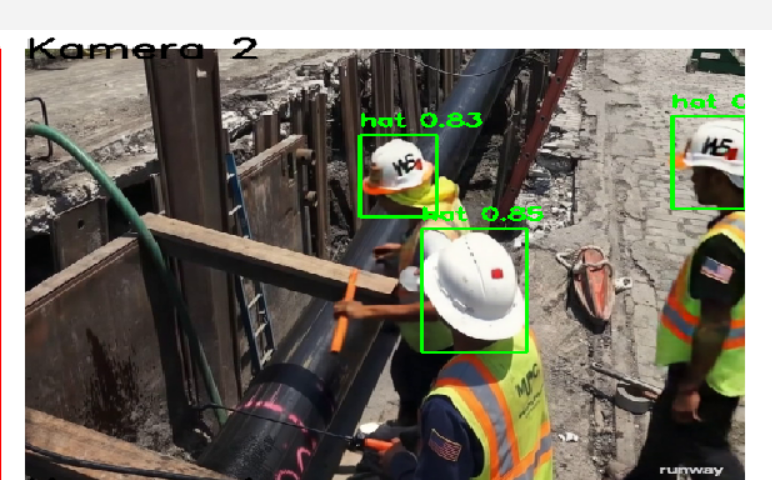
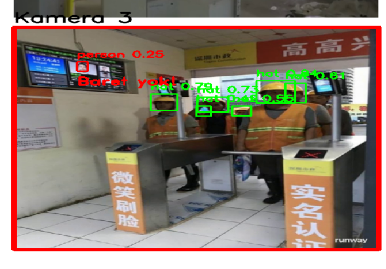
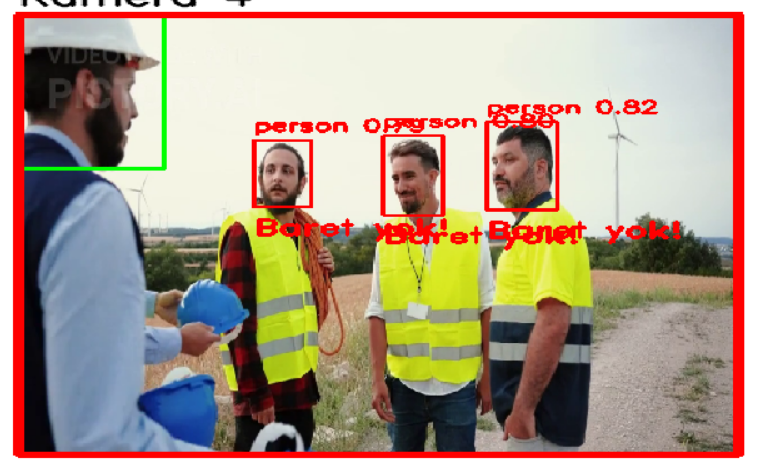

YOLOv8 İLE BARETSİZ İNSAN TESPİTİ

📌 Tanıtım
Bu proje, çalışma alanlarında baret takmayan kişilerin otomatik olarak tespit edilmesini amaçlamaktadır. YOLOv8 modeli kullanılarak "hat" ve "person" olmak üzere nesne tespiti sağlanmış, baretli ve baretsiz insanların ayrımı bu sınıflar üzerinden yapılmıştır. Gerçek zamanlı bir izleme sistemini simüle edebilmek için dört farklı video kullanılmış, eğitilen model bu videolara uygulanarak kamera görüntülerine benzer bir simülasyon ortamı oluşturulmuştur. Bu sayede sistem hem model doğruluğu hem de potansiyel pratik kullanım açısından test edilmiştir.

🧰 Kullanılan Teknolojiler
•Python
•Ultralytics YOLOv8
•OpenCV
•PyTorch

📂 Veri Seti
Kaynak: https://universe.roboflow.com/zayed-uddin-chowdhury-ghymx/safety-helmet-wearing-dataset

🧠 Model Eğitimi
Kullanılan model: YOLOv8m
Epoch sayısı: 20
Batch size: 16
Sonuçlar: 
Sınıf   	Doğruluk (P)	 Duyarlılık (R) 	mAP@0.5	  mAP@0.5:0.95
hat 	       0.928	         0.871	       0.928	      0.691
person	     0.935           0.879         0.939	      0.480
Tümü	       0.932	         0.875	       0.934	      0.586

📌 mAP@0.5 değerleri her iki sınıf için de %93’ün üzerinde olup modelin nesneleri yüksek doğrulukla tanıyabildiğini göstermektedir.
📌 mAP@0.5:0.95 değeri ise ortalama %58 civarındadır; bu da farklı IoU eşiklerinde modelin genel başarımını yansıtır.

🖼️ Model Çıktıları ve Tespit Sonuçları

### 🖼️ Model Çıktıları ve Tespit Sonuçları

Modelin "hat" ve "person" sınıflarını başarıyla tespit ettiği ve simüle edilmiş kamera frameleri üzerinde baretsiz çalışan tespit ettiğinde uyarı verdiği örnek görüntüler aşağıda yer almaktadır:

